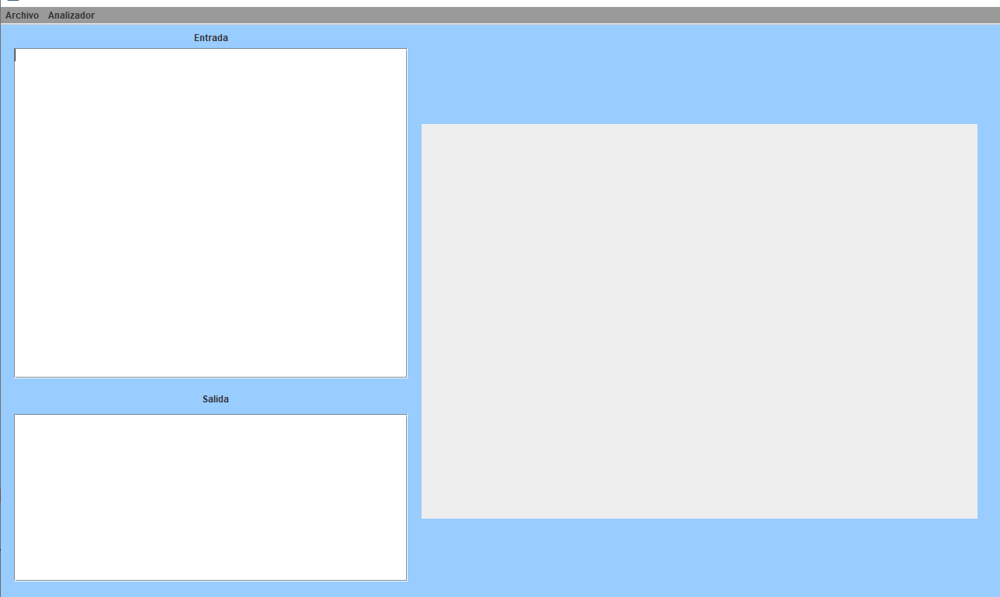
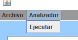
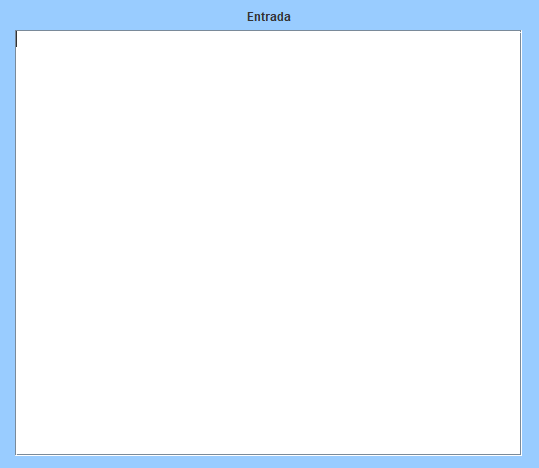
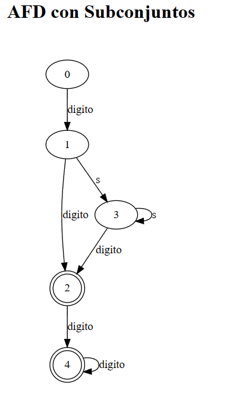
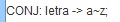
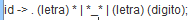

# Manual De Usuario
# Proyecto 1 Organizacion de Lenguajes y Compiladores 1

## **Objetivos e Información del Sistema**

Este Programa con su propia sintaxis, es capaz de leer declaraciones regulares, y expresiones regulares, para después convertir las expresiones regulares en un AFN con el método de thompson; para luego convertir el AFN a AFD con el método de subconjuntos y graficarlos en un reporte html con la ayuda de la libreria Graphviz.

## Requisitos del sistema

------------
*  Procesador AMD Ryzen 5 3400G o superior
* 16 Gb Ram
* Gráficos Radeon RX 6600 o superior
* Conexión a internet
* Navegador Web
* Java

## Interfaz

En la interfaz podemos encontrar todos los controles para usar el programa.

### Archivos

En este apartado podemos abrir archivos, guardar y guardar como.

### Analizador

En este apartado podemos elegir la opción de ejecutar nuestro codigo en el programa para generar los automatas.

### Entrada 

En este apartado encontraremos un cuadro de texto donde podremos escribir el codigo que queramos, o editar el de un archivo subido.

### Graficas

Después de ejecutar el análisis del código escrito, se nos abrirán unos reportes en html de los grafos.

### Reporte Tokens y Errores

Después de generarse los grafos, se generaran los reportes de tokens y de errores en archivos html.

## Lenguaje Para Expresiones Regulares

Este lenguaje es case Insensitive y todo el código debe estár delimitado por llaves.

En este lenguaje se pueden hacer 2 tipos de sentencias:

* Definicion de Conjuntos
* Definicion de Expresiones Regulares

### Definición de Conjuntos

Estas definiciones llevan la siguiente estructura:

donde "letra" es el identificador del conjunto, y lo que le sigue a la flecha es el conjunto.

### Definición de Expresiones Regulares

Estas definiciones llevan la siguiente estructura:

Llevan primero un identificador, y luego de la flecha se escribe la expresión regular. La expresión regular se escribe en notación prefija.

