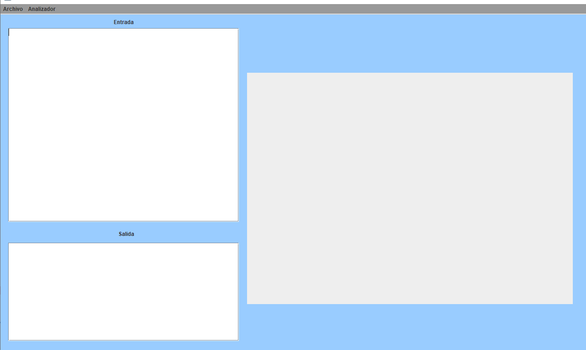
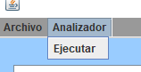
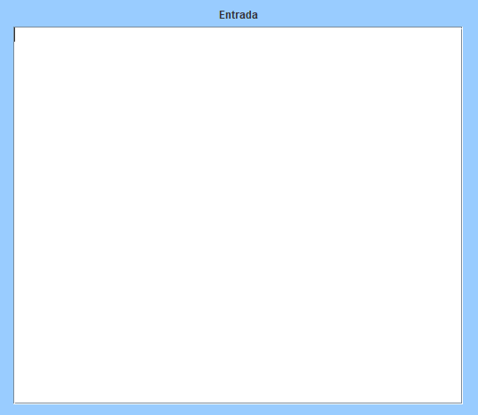
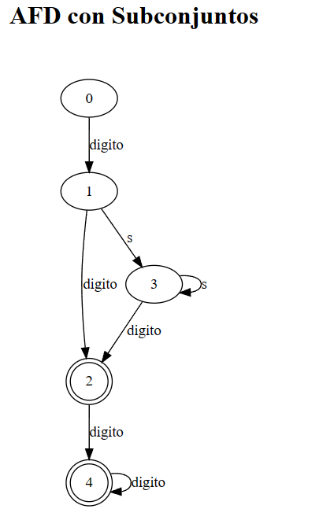
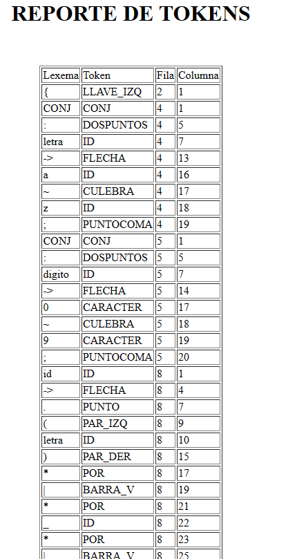
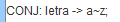
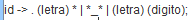

# Manual De Usuario
# Proyecto 1 Organizacion de Lenguajes y Compiladores 1

## **Objetivos e Información del Sistema**

Este Programa con su propia sintaxis, es capaz de leer declaraciones regulares, y expresiones regulares, para después convertir las expresiones regulares en un AFN con el método de thompson; para luego convertir el AFN a AFD con el método de subconjuntos y graficarlos en un reporte html con la ayuda de la libreria Graphviz.

## Requisitos del sistema

------------
*  Procesador AMD Ryzen 5 3400G o superior
* 16 Gb Ram
* Gráficos Radeon RX 6600 o superior
* Conexión a internet
* Navegador Web
* Java

## Interfaz

En la interfaz podemos encontrar todos los controles para usar el programa.

### Archivos

En este apartado podemos abrir archivos, guardar y guardar como.

### Analizador

En este apartado podemos elegir la opción de ejecutar nuestro codigo en el programa para generar los automatas.

### Entrada 

En este apartado encontraremos un cuadro de texto donde podremos escribir el codigo que queramos, o editar el de un archivo subido.

### Graficas

Después de ejecutar el análisis del código escrito, se nos abrirán unos reportes en html de los grafos.

### Reporte Tokens y Errores

Después de generarse los grafos, se generaran los reportes de tokens y de errores en archivos html.

## Lenguaje Para Expresiones Regulares

Este lenguaje es case Insensitive y todo el código debe estár delimitado por llaves.

En este lenguaje se pueden hacer 2 tipos de sentencias:

* Definicion de Conjuntos
* Definicion de Expresiones Regulares

### Definición de Conjuntos

Estas definiciones llevan la siguiente estructura:

donde "letra" es el identificador del conjunto, y lo que le sigue a la flecha es el conjunto.

### Definición de Expresiones Regulares

Estas definiciones llevan la siguiente estructura:

Llevan primero un identificador, y luego de la flecha se escribe la expresión regular. La expresión regular se escribe en notación prefija.

# Manual De Tecnico
# Proyecto 1 Organizacion de Lenguajes i Compiladores 1

## **Objetivos e Información del Sistema**

Este Programa con su propia sintaxis, es capaz de leer declaraciones regulares, y expresiones regulares, para después convertir las expresiones regulares en un AFN con el método de thompson; para luego convertir el AFN a AFD con el método de subconjuntos y graficarlos en un reporte html con la ayuda de la libreria Graphviz.

## Requisitos del sistema

------------
*  Procesador AMD Ryzen 5 3400G o superior
* 16 Gb Ram
* Gráficos Radeon RX 6600 o superior
* Conexión a internet
* Navegador Web
* Java

## Lenguaje y herramientas utilizadas

### Java

Se utilizó java como lenguaje de programación.

### Paradigma de programación

El paradigma usado fue programación orientada a objetos.

### JFlex

JFlex fue la herramienta para el análisis léxico del programa.

### Cup

Cup fue la herramienta para el análisis sintáctico del programa.

## Gramatica utilizadas

main::= LLAVE_IZQ sentencias LLAVE_DER

sentencias::= sentencias sentencia 

        | sentencia

sentencia::= conjunto

        | expRel

conjunto ::= CONJ DOSPUNTOS ID FLECHA expCon PUNTOCOMA 

expRel::= ID FLECHA e PUNTOCOMA 

expCon::= ID  

        |CARACTER
        |STRING
        |expCon

expCon1::= CULEBRACARACTER 

        |CULEBRA ID 
        |CULEBRA STRING 
        |COMA CARACTER 
        |COMA ID 
        |COMA STRING 
    

e    ::= valor

        |op

valor::= PAR_IZQ valor1 PAR_DER 

        | valor1

valor1 ::= ID

        |CARACTER
        |STRING
      

op   ::= BARRA_V e e 

        | op1

op1  ::= PUNTO e e 

        |op2

op2  ::= INT e

        |op3

op3  ::= MAS e 

        |op4

op4 ::= POR e 

## Clases y paquetes

### Paquete analizador

Contiene todos los archivos .jFlex y .cup usados para generar los analizadores sintácticos y léxicos para el lenguaje.

### Paquete structuras

Contiene las estructuras usadas en el proyecto.

#### Clase elToken

Parametros
* lexema
* token
* linea
* Columna

#### Clase fallos

Parametros
* lexema
* desc
* fila
* columna

#### Clase tablaJson

Parametros 
* id
* valor

### Paquete com.mycompany.proyecto1.igu

Contiene la interfaz gráfica utilizada para el proyecto

## Procedimiento Para la generación del AFN y AFD

Se analiza la entrada con jflex y cup, para luego crear un arbol con la gramática en el parser creado por cup. Luego partiendo del arbol, se genera el AFN con ayuda del método de thompson, para luego generar el AFD con ayuda del método de subconjuntos.

